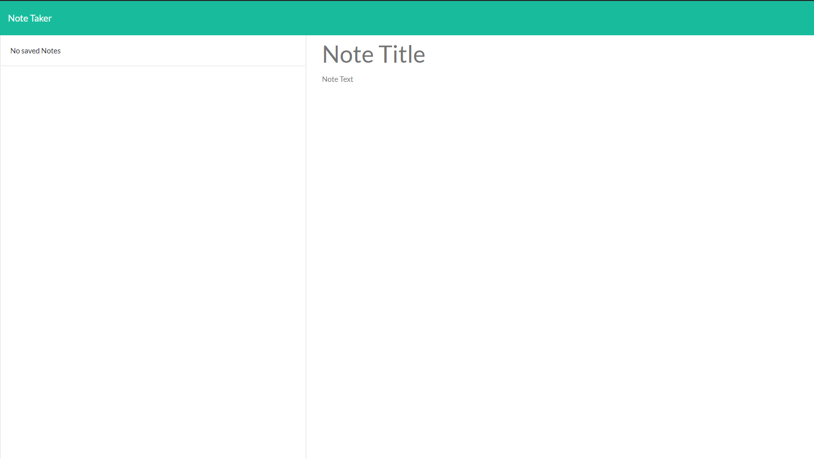

# Note Taker

## Developed By: Troy Grossi

 
 

# Description

This is a simple server based application that helps the user take and organize notes. The primary purpose of this project is to practice my server side developer skills. All front end files were provided by Trilogy through the UC Berkley coding bootcamp. All server side work and deployment of the application was done by me.

# Table of Contents

- [Installation](#installation)

- [Usage](#usage)

- [Contribution](#contribution)

- [License](#license)

<!---->

- [Questions](#questions)

# Installation

To install this project download the files from gitHub. If you wish to run or edit this project locally, you must install the dependencies. You must first install node and then through the terminal and with the package files directory set to the end of the path type <npm install> to get the express dependency. You can also create a remote server through heroku by downloading heroku, then typing <heroku create> and then <heroku open> to access the application through the remote server.

# Usage

Create, save, and delete notes by clicking the respective text areas and icons

Deployed url: https://tjg-note-taker.herokuapp.com/

Screenshot:

# Contribution

Refer to:
[Contribution Convenant](https://www.contributor-covenant.org/version/2/0/code_of_conduct/code_of_conduct.md)

# License

MIT

<!---->

# Questions

- GitHub Name: troygrossi
- GitHub Link: https://github.com/troygrossi/note-taker
